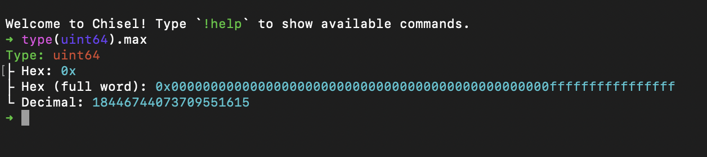

# Cross-Chain Attack Vectors 🌉🛡️

`Note`: These vectors are related to the protocols which integrates with LayerZero.
<br><br>**If you find any vectors missing, you can create a pull request and be a contributor of the project.**


## Introduction to Cross-Chain-Bridge

As the Web3 ecosystem grows more diverse and decentralized, applications, assets, and user activity are spreading across multiple blockchain networks. While this multi-chain paradigm offers scalability and specialization, it also creates fragmentation—isolated blockchains cannot natively communicate with each other. This limits the flow of value and information across the broader ecosystem.

Cross-chain bridges are the infrastructure that solves this problem and enables the transfer of assets and data between different blockchain networks. It acts as a secure connection between two or more chains, allowing tokens and information to move across them without relying on centralized intermediaries.


These bridges play a crucial role in enabling blockchain interoperability, where isolated networks become part of a larger, interconnected ecosystem. By locking, burning, minting, or unlocking tokens across chains and optionally passing arbitrary messages cross-chain bridges unlock a wide range of use cases in decentralized finance (DeFi), NFTs, gaming, and more.


## Deep Diving into the attack vectors

## 1. Incorrect Refund Address in `_lzSend`

>📌 When using LayerZero's `_lzSend`, passing `payable(msg.sender)` from an internal contract call like `_sendMessage()` refunds excess fees to the intermediate contract  instead of the original user.<br>This causes users to lose refundable LayerZero fees, creating an unfair economic burden.

Protocols integrating LayerZero often use the internal `_lzSend` method for cross-chain messaging. A typical pattern looks like this:

1. A public `sendMessage` function in `ContractA` is called by the user to send some data for cross-chain messaging.
2. `sendMessage` then calls an `_sendMessage` function in `ContractB`, which is restricted to only be called by `ContractA`.
3. `_sendMessage` calls `_lzSend()` and passes `payable(msg.sender)` as the refund address.

Example Code: 

```javascript
function _sendMessage(
    bytes memory _data,
    uint32 _destId,
    uint256 _lzFee,
    address refundAddress 
) external override payable OnlyContractA {
    MessagingReceipt memory receipt = _lzSend(
        _destId,
        _data,
        optionsDestId[_destId],
        MessagingFee(_lzFee, 0),
        payable(msg.sender) // ❌ Incorrect: refunds go to ContractA
    );
}

```

In this flow, msg.sender inside _sendMessage refers to ContractA, not the original user who initiated the call. This means any excess LayerZero fee (if unused) is refunded to the contract, not the user.

As a result, users pay more than necessary for cross-chain messaging and lose the refundable portion of the LayerZero fee — creating an unfair economic burden.

>To prevent this, we have to refactor the architecture so that the original user’s address is passed explicitly as a parameter to the refund address in _lzSend.<br> Then, in ContractA pass msg.sender  as refundAddress when calling sendMessage().


## 2. Improper Fee and Dust Handling in OFT Transfers Can Lead to Value Loss

>📌 When using LayerZero’s OFT standard, overlooking the interaction between fee deduction and decimal conversion can lead to silent token loss—especially with small transfers. The default implementation applies dust removal before fees, and then converts to shared decimals (usually 6), which can round user balances down to zero.


When implementing LayerZero's OFT (Omnichain Fungible Token) standard, pay special attention to the decimal conversion mechanism, particularly when combined with fee implementations.

The OFT standard was designed for cross-chain token transfers between different blockchain virtual machines.

The default OFT implementation from LayerZero has a concept of local decimals and shared decimals:

- Local decimals: Specific to each chain (often 18 decimals for EVM chains)
- Shared decimals: Hardcoded in OFTCore to 6 decimals

This creates a [decimalConversionRate](https://github.com/LayerZero-Labs/LayerZero-v2/blob/943ce4a2bbac070f838e12c7fd034bca6a281ccf/packages/layerzero-v2/evm/oapp/contracts/oft/OFTCore.sol#L56) (typically 10^12 for tokens with 18 local decimals) that can cause funds to be lost when improperly implemented, especially when combined with fee mechanisms.

Let’s see the  following vulnerable [code](https://github.com/windhustler/audits/blob/21bf9a13cc8a4bfd463f055f197ec7f2511030e9/solo/PING-Security-Review.pdf):
1. The dust is removed from the given user input amount.

For example: 
```javascript
amountToSend = 1500000000000000001
sharedAmount = amountToSend / 10^12 = 1500000;
amountSentLD = sharedAmount * 10^12 = 1500000000000000000;

```
so, dust removed  from the input is 1 wei.

2. feeAmount is calculated based on the percentage and this feeAmount is subtracted from the amountSentLD.

```javascript
function _debitView(
	uint256 _amountLD,
	uint256 _minAmountLD,
	uint32 /*_dstEid*/
	) internal view virtual override returns (uint256 amountSentLD,
uint256 amountReceivedLD) {
	// @dev Remove the dust so nothing is lost on the conversion
  //between chains with different decimals for the token.
	amountSentLD = _removeDust(_amountLD);
	
 // Calculate the fee amount based on the percentage
	uint256 feeAmount = (amountSentLD * _feeNumerator) / (
FEE_DENOMINATOR * 100);

 // Deduct the fee amount from the amount to be sent
 amountReceivedLD = amountSentLD - feeAmount;

 // @dev Check for slippage.
 if (amountReceivedLD < _minAmountLD) {
 revert SlippageExceeded(amountReceivedLD, _minAmountLD);
 }
 }
```

But here is the catch:  The  above implementation doesn’t care about the following execution flow.

After the [_debit](https://github.com/LayerZero-Labs/LayerZero-v2/blob/943ce4a2bbac070f838e12c7fd034bca6a281ccf/packages/layerzero-v2/evm/oapp/contracts/oft/OFTCore.sol#L181)  function call, there is another call happening to the [_buildMsgAndOptions](https://github.com/LayerZero-Labs/LayerZero-v2/blob/943ce4a2bbac070f838e12c7fd034bca6a281ccf/packages/layerzero-v2/evm/oapp/contracts/oft/OFTCore.sol#L189). 
In this flow, the amount is changed from local decimals to shared decimals.

```javascript
    function _buildMsgAndOptions(
        SendParam calldata _sendParam,
        uint256 _amountLD
    ) internal view virtual returns (bytes memory message, bytes memory options) {
        bool hasCompose;
        // @dev This generated message has the msg.sender encoded into the payload so the remote knows who the caller is.
        (message, hasCompose) = OFTMsgCodec.encode(
            _sendParam.to,
    @>>>   _toSD(_amountLD),
            // @dev Must be include a non empty bytes if you want to compose, EVEN if you dont need it on the remote.
            // EVEN if you dont require an arbitrary payload to be sent... eg. '0x01'
            _sendParam.composeMsg
        );
        // @dev Change the msg type depending if its composed or not.
        uint16 msgType = hasCompose ? SEND_AND_CALL : SEND;
        // @dev Combine the callers _extraOptions with the enforced options via the OAppOptionsType3.
        options = combineOptions(_sendParam.dstEid, msgType, _sendParam.extraOptions);

        // @dev Optionally inspect the message and options depending if the OApp owner has set a msg inspector.
        // @dev If it fails inspection, needs to revert in the implementation. ie. does not rely on return boolean
        if (msgInspector != address(0)) IOAppMsgInspector(msgInspector).inspect(message, options);
    } 
    
     /**
     * @dev Internal function to convert an amount from local decimals into shared decimals.
     * @param _amountLD The amount in local decimals.
     * @return amountSD The amount in shared decimals.
     */
    function _toSD(uint256 _amountLD) internal view virtual returns (uint64 amountSD) {
        return uint64(_amountLD / decimalConversionRate);
    }
    
     /**
     * @dev Internal function to handle the receive on the LayerZero endpoint.
     * @param _origin The origin information.
     *  - srcEid: The source chain endpoint ID.
     *  - sender: The sender address from the src chain.
     *  - nonce: The nonce of the LayerZero message.
     * @param _guid The unique identifier for the received LayerZero message.
     * @param _message The encoded message.
     * @dev _executor The address of the executor.
     * @dev _extraData Additional data.
     */
    function _lzReceive(
        Origin calldata _origin,
        bytes32 _guid,
        bytes calldata _message,
        address /*_executor*/, // @dev unused in the default implementation.
        bytes calldata /*_extraData*/ // @dev unused in the default implementation.
    ) internal virtual override {
        // @dev The src sending chain doesnt know the address length on this chain (potentially non-evm)
        // Thus everything is bytes32() encoded in flight.
        address toAddress = _message.sendTo().bytes32ToAddress();
        // @dev Credit the amountLD to the recipient and return the ACTUAL amount the recipient received in local decimals
        uint256 amountReceivedLD = _credit(toAddress, _toLD(_message.amountSD()), _origin.srcEid);

        if (_message.isComposed()) {
            // @dev Proprietary composeMsg format for the OFT.
            bytes memory composeMsg = OFTComposeMsgCodec.encode(
                _origin.nonce,
                _origin.srcEid,
                amountReceivedLD,
                _message.composeMsg()
            );

            // @dev Stores the lzCompose payload that will be executed in a separate tx.
            // Standardizes functionality for executing arbitrary contract invocation on some non-evm chains.
            // @dev The off-chain executor will listen and process the msg based on the src-chain-callers compose options passed.
            // @dev The index is used when a OApp needs to compose multiple msgs on lzReceive.
            // For default OFT implementation there is only 1 compose msg per lzReceive, thus its always 0.
            endpoint.sendCompose(toAddress, _guid, 0 /* the index of the composed message*/, composeMsg);
        }

        emit OFTReceived(_guid, _origin.srcEid, toAddress, amountReceivedLD);
    }
    
     /**
     * @dev Internal function to convert an amount from shared decimals into local decimals.
     * @param _amountSD The amount in shared decimals.
     * @return amountLD The amount in local decimals.
     */
    function _toLD(uint64 _amountSD) internal view virtual returns (uint256 amountLD) {
        return _amountSD * decimalConversionRate;
    }
    
    
```

Let’s  examine the fault implementation with the given example.

1. User initiates transfer of 1,000,000,000,000 tokens (1 * 10^12).
2. There is  no dust to remove as amount is exactly 10^12
3. Fee calculation: 1,000,000,000,000 * 0.01 = 10,000,000,000 tokens (with _feeNumerator as 100).
4. Amount after fee: 1,000,000,000,000 - 10,000,000,000 = 990,000,000,000 tokens
5. Conversion to shared decimals: 990,000,000,000 ÷ 10^12 = 0.99 (rounds down to 0)
6. Amount received on destination chain: 0 * 10^12 = 0 tokens
7.  User loses all 1,000,000,000,000 tokens with nothing received


>To avoid these, we can   apply fees first, then remove dust to ensure valid amounts and add explicit checks to prevent transfers that would result in zero tokens on the destination chain.


## **3. Risk of Silent Value Truncation When Overriding sharedDecimals**


>📌 When overriding the default sharedDecimals (default is 6) in OFTCore.sol to a higher value like 18, be cautious: the _toSD() function converts amounts using uint64, which silently truncates large values beyond ~1.84e19. This truncation does not revert and can result in users unintentionally losing up to 92% of their tokens during cross-chain transfers.


When integrating with LayerZero's OFTCore.sol contract, protocols must be aware of a critical limitation when overriding the default sharedDecimals value. It's crucial to understand the behaviour of the _toSD function and how it interacts with sharedDecimals.

The OFTCore.sol contract uses a default [sharedDecimals](https://github.com/LayerZero-Labs/LayerZero-v2/blob/943ce4a2bbac070f838e12c7fd034bca6a281ccf/packages/layerzero-v2/evm/oapp/contracts/oft/OFTCore.sol#L83) value of 6.  If this value is overridden (e.g., set to 18), the **`_toSD`** function may truncate large amounts due to a **`uint64`** cast during decimal conversion.


```javascript

    constructor(uint8 _localDecimals, address _endpoint, address _delegate) OApp(_endpoint, _delegate) {
        if (_localDecimals < sharedDecimals()) revert InvalidLocalDecimals();
        decimalConversionRate = 10 ** (_localDecimals - sharedDecimals());
    }
     //...code 
     /**
     * @dev Internal function to convert an amount from local decimals into shared decimals.
     * @param _amountLD The amount in local decimals.
     * @return amountSD The amount in shared decimals.
     */
    function _toSD(uint256 _amountLD) internal view virtual returns (uint64 amountSD) {
        return uint64(_amountLD / decimalConversionRate);
    }
		//...code 

```

If decimalConversionRate == 1 (i.e., both localDecimals and sharedDecimals are set to 18), then:

- Any _amountLD greater than uint64.max (≈ 1.84e19) will **silently truncate** to fit uint64.
- This can cause **unexpected loss of value** during transfers.
- The user may attempt to transfer a large amount thinking it will succeed, but only the lower 64-bit portion will be processed.



 Let’s see the above issue with an example:

Assume the following configuration:

localDecimals = 18

sharedDecimals = 18 → so decimalConversionRate = 10^(localDecimals - sharedDecimals) = 1

Function _toSD() becomes:

```javascript
function _toSD(uint256 _amountLD) internal view virtual returns (uint64 amountSD) {
    return uint64(_amountLD); // since decimalConversionRate = 1
}

```

Let’s say a user tries to transfer  2e20  (i.e., _amountLD =  200,000,000,000,000,000,000)

This is a valid `uint256`, but in the _toSD function, the following execution is done

```javascript
_toSD(2e20) = uint64(2e20) = 2e20 % 2^64 = 2e20 % 18,446,744,073,709,551,616
           ≈ 2e20 - (10 * 1.844674407e19)
           ≈ 200,000,000,000,000,000,000 - 184,467,440,737,095,516,160
           ≈ 15,532,559,262,904,483,840

```

So instead of sending 200e18, the contract only recognizes ~15.5e18 — nearly 92% loss.

>This leads to the transfer executes with **no revert** and users may **lose funds** due to unnoticed truncation.


## 4. Missing  receive() Function for Refund Address


>📌 When using msg.value in LayerZero’s _lzSend, always ensure the specified _refundAddress can accept native token refunds — this means implementing a receive() function if the contract is its own refund address. Without it, excess fees cannot be refunded, leading to transaction reverts even if everything else is correct. If a contract is used as the refund address, add receive() external payable {} and a secure withdrawal mechanism to recover leftover fees.


When a contract inherits from layer zero contracts  and uses itself (or another contract) as the refund address in LayerZero's _lzSend function, the refund address contract must implement a receive() function to handle native token refunds. Without this function, excess fees cannot be refunded, causing transactions to revert.

Let’s understand the above pattern with some code:

```javascript
contract MyOApp is OApp {
    function sendMessage(uint32 _dstEid, bytes memory _payload) external payable {
        _lzSend(
            _dstEid,
            _payload,
            _options,
            MessagingFee(msg.value, 0),
            payable(address(this)) // ❌ This contract as refund address
        );
    }
    
    // ❌ Missing receive() function - refunds will fail!
}
```


>If the intention is to take the excess fees through the smart contract  then always implement `receive() external payable {} `in contracts that serve as LayerZero refund addresses, whether directly or through proxy patterns. <br>More importantly, don’t forget to implement a mechanism to withdraw the excess fee which is sent to the contract only by the authorised addresses.


## 5. Insufficient Gas Limit for lzReceive() Execution


>📌 One of the most critical aspects of LayerZero integration is ensuring adequate gas limits for cross-chain message execution. Insufficient gas limits will cause lzReceive() calls to fail on the destination chain, requiring expensive retry operations and degrading user experience.


In LayerZero, lzReceive() is a crucial function that handles incoming messages on the destination chain. When a message is sent from one chain to another chain  using LayerZero, the destination chain's Endpoint calls lzReceive() on the target contract, which then decodes and processes the message data. 

When sending cross-chain messages via LayerZero, developers must specify gas limits for the execution of lzReceive() on the destination chain through the options parameter. 

A common mistake is underestimating the actual gas consumption of the destination chain operations, leading to out-of-gas errors.

Consider the following [example](https://solodit.cyfrin.io/issues/h-02-lzreceive-call-for-releaseoneid-results-in-oog-error-pashov-audit-group-none-nftmirror_2024-12-30-markdown):

```javascript
    uint128 private constant _BASE_OWNERSHIP_UPDATE_COST = 80_000;
    (...)
    uint128 private constant _INCREMENTAL_OWNERSHIP_UPDATE_COST = 20_000; 
    (...)
    function getSendOptions(uint256[] calldata tokenIds) public pure returns (bytes memory) {
        uint128 totalGasRequired =
            _BASE_OWNERSHIP_UPDATE_COST + (_INCREMENTAL_OWNERSHIP_UPDATE_COST * uint128(tokenIds.length));

        return OptionsBuilder.newOptions().addExecutorLzReceiveOption(totalGasRequired, 0);
    }
```

The calculation allocates only 20,000 gas per token ID but  each shadow NFT mint operation alone costs ~46,700 gas. With transfers, it’s ~27,300 gas. When a transfer validator is used, it increases even further due to validation logic. 

This leads to the lzReceive() call consistently fails with out-of-gas errors, forcing users to manually retry with higher gas limits.

## 6. Mint / Burn Pattern with ERC-4626 Vaults


>📌 Using the Mint/Burn model for cross-chain ERC-4626 token transfers can artificially inflate share value on the source chain. This allows users who remain on the original chain to redeem more than their fair share, effectively draining value from cross-chain participants.


When implementing cross-chain token transfers using the LayerZero OFT (Omnichain Fungible Token) standard, developers must decide how to handle token accounting on the source and destination chains. The two common approaches are:

- **Lock/Unlock**: Tokens are locked on the source chain and unlocked on the destination
- **Mint/Burn**: Tokens are burned on the source chain and minted on the destination

While Mint/Burn is often convenient for fungible tokens, it introduces subtle but critical issues when applied to ERC-4626 vaults. ERC-4626 vaults calculate share value as assets / totalSupply. 

>If shares are burned during cross-chain transfers, totalSupply decreases, which inflates the value of the remaining shares on the source chain. This creates opportunities for value extraction and loss of funds for users transferring between chains.

Example: [1](https://solodit.cyfrin.io/issues/users-may-lose-value-when-transferring-erc-4626-vault-tokens-cross-chain-cyfrin-none-d-markdown)


## 7. Out of Gas (OOG) Error in lzReceive Function


>📌 When a message is processed via lzReceive(), LayerZero’s internal _clearPayload() function attempts to update the lazyInboundNonce by iterating through all unprocessed nonces up to the current one.<br><br>If a high-nonce message (e.g., nonce 10,000) is received while the last processed nonce is low (e.g., 1), the function will loop through thousands of intermediate nonces. This can lead to an out-of-gas (OOG) error during execution.


The lzReceive function may revert with an "out of gas" (OOG) error due to excessive gas consumption during the [_clearPayload](https://github.com/LayerZero-Labs/LayerZero-v2/blob/592625b9e5967643853476445ffe0e777360b906/packages/layerzero-v2/evm/protocol/contracts/MessagingChannel.sol#L134-L142) execution. This occurs when processing a message with a nonce significantly higher than the current lazyInboundNonce for the given receiver, source chain (srcEid), and sender. 

The _clearPayload function loops through all nonces from currentNonce + 1 up to the incoming message's nonce to validate their payload hashes. If the gap between currentNonce and the incoming nonce is large, the loop may exceed the gas limit, causing a transaction failure.

>This error can be [mitigated](https://github.com/windhustler/Interoperability-Protocol-Security-Checklist/blob/main/audit-checklists/LayerZeroV2.md#lzreceive-function-can-revert-with-an-out-of-gas-oog-error) by processing  messages in strict nonce order (lowest nonce first) to increment lazyInboundNonce incrementally. <br> This ensures the loop in _clearPayload only iterates once per message, avoiding gas exhaustion.

## 8. Enforce from and msg.sender checks in lzCompose implementations


>📌 The lzCompose function is executed asynchronously by LayerZero’s EndpointV2 after a message is received. If you do not strictly validate: <br>  `from`: Must be the original contract (OFT) that called sendCompose <br> `msg.sender`: Must be the official LayerZero EndpointV2 contract<br>then malicious composed messages will be executed by the unauthorised addresses.


Consider the default [OFT](https://github.com/LayerZero-Labs/LayerZero-v2/blob/592625b9e5967643853476445ffe0e777360b906/packages/layerzero-v2/evm/oapp/contracts/oft/OFTCore.sol#L236) implementation in LayerZero:

```javascript
//OFTCore.sol
function _lzReceive(...) internal virtual override {

    //...
    address toAddress = _message.sendTo().bytes32ToAddress();
   @>>uint256 amountReceivedLD = _credit(toAddress, _toLD(_message.amountSD()), _origin.srcEid);

    if (_message.isComposed()) {
        bytes memory composeMsg = OFTComposeMsgCodec.encode(...);
   @>>  endpoint.sendCompose(toAddress, _guid, 0, composeMsg);
    }
    
    //...
}

```

1. Tokens are credited to `toAddress`.
2. Then, `sendCompose` is called to queue the composed message for a later call to `lzCompose`.

```javascript
//MessagingComposer.sol

function sendCompose(address _to, bytes32 _guid, uint16 _index, bytes calldata _message) external {
    // must have not been sent before
    if (composeQueue[msg.sender][_to][_guid][_index] != NO_MESSAGE_HASH) revert Errors.LZ_ComposeExists();
@>>    composeQueue[msg.sender][_to][_guid][_index] = keccak256(_message);
    emit ComposeSent(msg.sender, _to, _guid, _index, _message);
}

function lzCompose(
    address _from,
    address _to,
    bytes32 _guid,
    uint16 _index,
    bytes calldata _message,
    bytes calldata _extraData
) external payable {
    // assert the validity
    bytes32 expectedHash = composeQueue[_from][_to][_guid][_index];
    bytes32 actualHash = keccak256(_message);
    if (expectedHash != actualHash) revert Errors.LZ_ComposeNotFound(expectedHash, actualHash);

    // marks the message as received to prevent reentrancy
    // cannot just delete the value, otherwise the message can be sent again and could result in some undefined behaviour
    // even though the sender(composing Oapp) is implicitly fully trusted by the composer.
    // eg. sender may not even realize it has such a bug
@>>    composeQueue[_from][_to][_guid][_index] = RECEIVED_MESSAGE_HASH;
    ILayerZeroComposer(_to).lzCompose{ value: msg.value }(_from, _guid, _message, msg.sender, _extraData);
    emit ComposeDelivered(_from, _to, _guid, _index);
}
```

`sendCompose` records the hash using msg.sender as the origin (usually the OFT contract).

Later, `lzCompose` is expected to come only from the EndpointV2, and must match the original from.

>If a contract incorrectly trusts the `lzCompose` input without verifying: <br> That `from` is indeed the expected OFT contract.<br> That `msg.sender` is the LayerZero endpoint, not an arbitrary address...<br>This leads to the execution of composed messages by the unauthorised addresses.


## 9. **Validate All Critical Parameters in Cross-Chain Messages**


>📌 In LayerZero-based protocols, once the message is verified by the endpoint, anyone can call lzReceive with arbitrary msg.value. If your contract [logic](https://solodit.cyfrin.io/issues/bridgedgovernorlzreceive-can-be-executed-with-different-msgvalue-than-intended-cantina-none-drips-pdf)  depends on the amount of ETH forwarded, not validating msg.value against an expected value opens the door to frontrunning attacks.


Consider the following [example](https://solodit.cyfrin.io/issues/bridgedgovernorlzreceive-can-be-executed-with-different-msgvalue-than-intended-cantina-none-drips-pdf):

```javascript
// BridgedGovernor.sol

function lzReceive(
			Origin calldata origin,
			bytes32, /* guid */
			bytes calldata message,
			address, /* executor */
			bytes calldata /* extraData */
) public payable onlyProxy {
			require(msg.sender == endpoint, "Must be called by the endpoint");
			require(origin.srcEid == ownerEid, "Invalid message source chain");
			require(origin.sender == owner, "Invalid message sender");
			require(origin.nonce == _lastNonce + 1, "Invalid message nonce");
			// slither-disable-next-line events-maths
			_lastNonce = origin.nonce;
			runCalls(abi.decode(message, (Call[])));
}
```

In the above logic, 

1. The contract does not validate msg.value against any expected value.
2. The EndpointV2.lzReceive function is publicly callable after verification.
3. A malicious actor can front-run the legitimate executor and supply a different msg.value.
4. This can cause downstream logic in runCalls() to behave differently than intended.

>This can be mitigated by encoding the expected `msg.value` as part of the message payload on the source chain. On the destination, decode it and validate it against `msg.value` before executing any logic.


## 10. Avoid Irrecoverable Deadlocks from Strict Ordered Execution in LayerZero

>📌 If your contract uses `lzReceive` with strict nonce enforcement, then a single malformed or failing message can permanently block all future messages.


When using LayerZero with ordered execution (via nextNonce), the receiving contract strictly enforces that messages must be executed in the exact order of their nonce. If any message fails to execute—due to malformed payloads, invalid sub-calls, gas issues, or unexpected errors—it causes a hard block in the message flow: no future messages will be processed until the failed one is resolved. 

Let’s take some [buggy](https://solodit.cyfrin.io/issues/non-executable-messages-in-bridgedgovernor-can-result-in-an-unrecoverable-state-cantina-none-drips-pdf) example:

In the following BridgedGovernor contract, the `lzReceive` function enforces strictly ordered messages by requiring the nonce to be exactly lastNonce + 1. 

If a message with malformed data  is received, it will fail during execution—but the nonce will still be locked, preventing all subsequent valid messages from being processed.

```javascript
require(origin.nonce == _lastNonce + 1, "Invalid message nonce");
runCalls(abi.decode(message, (Call[]))); // Fails if message is malformed

```

Once this malformed message is received, the entire LayerZero message pipeline becomes stuck, and since `BridgedGovernor` upgrades itself via LZ messages, it cannot recover or patch the logic.

**Remediation**:
>For most use cases, prefer the default un-ordered execution mode.<br>If you need ordered execution, then implement it at the application level rather than relying on LayerZero nonces


## 11.  Ensure LayerZero Read Functions Never Revert (to Avoid Blocking Subsequent Messages)


>📌 When using LayerZero Read functionality, any revert in the data reading process (in readCount, lzMap, or lzReduce functions) can block the verification of the entire message. 

This creates a chain reaction where subsequent messages with higher nonces cannot be processed until the problematic message is either successfully verified or explicitly skipped.


When using LayerZero Read, if any read function like readCount, lzMap, or lzReduce reverts, the DVNs cannot generate a response. This prevents message verification, leaving the assigned nonce stuck. As a [result](https://github.com/windhustler/Interoperability-Protocol-Security-Checklist/blob/main/audit-checklists/LayerZeroV2.md#reverts-while-reading-data-blocks-subsequent-messages), subsequent messages cannot be processed, because LayerZero enforces ordered message delivery via lazyInboundNonce.

This means a single failed read (e.g., due to bad onchain logic or unhandled edge cases) can block your entire LayerZero Read message queue until that message is either Successfully verified or Explicitly skipped using `EndpointV2::skip()`

**Prevention:**

>While the **`skip`** function provides a way to unblock your message pipeline, it should not be used as a primary solution.
Focus on ensuring your read operations are robust and handle all edge cases gracefully to prevent verification failures in the first place.


## If you are building the protocol which integrates LayerZero, connect with the QuillAudits team to secure your protocol.

| Platform  | Links                    |
|-----------|---------------------------------|
| Telegram  | @QuillAudits                    |
| Twitter   | https://x.com/quillaudits_ai    |
| Website   | https://www.quillaudits.com/    |
| Email     | hello@quillaudits.com           |


### References:

[LayerZeroV2 Security Checklist](https://github.com/windhustler/Interoperability-Protocol-Security-Checklist/blob/main/audit-checklists/LayerZeroV2.md)
<br> [Solodit](https://solodit.cyfrin.io/?i=HIGH%2CMEDIUM)
